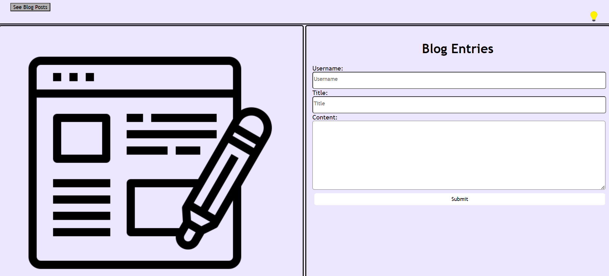
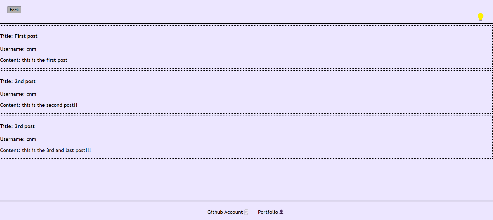

# My First Blog

## Description

A webpage that creates blog posts that render on a second page. A user will input their username, title, and their content on a form, then the user will be able to read all the posts that have been entered on the blog page. User can also toggle between dark and light mode. 

[URL link: https://cnm724.github.io/my_first_blog/](https://cnm724.github.io/my_first_blog/)

[Github Page: https://github.com/cnm724/my_first_blog](https://github.com/cnm724/my_first_blog)

## Usage
Landing Page

Posted Blog Entry Page

## Credits
* https://www.youtube.com/watch?v=9n3qAeaBMGU (store data on a localstorage)
* https://www.youtube.com/watch?v=G3e-cpL7ofc&t=12318s (buttons)
* https://forum.freecodecamp.org/t/how-do-you-make-text-start-from-top-of-a-text-box/213072 (textarea in html)
* Rene Trevino (Tutor) - collaborated on light and dark mode, and rendering blog posts to the page 
* Xpert
## License

MIT License
